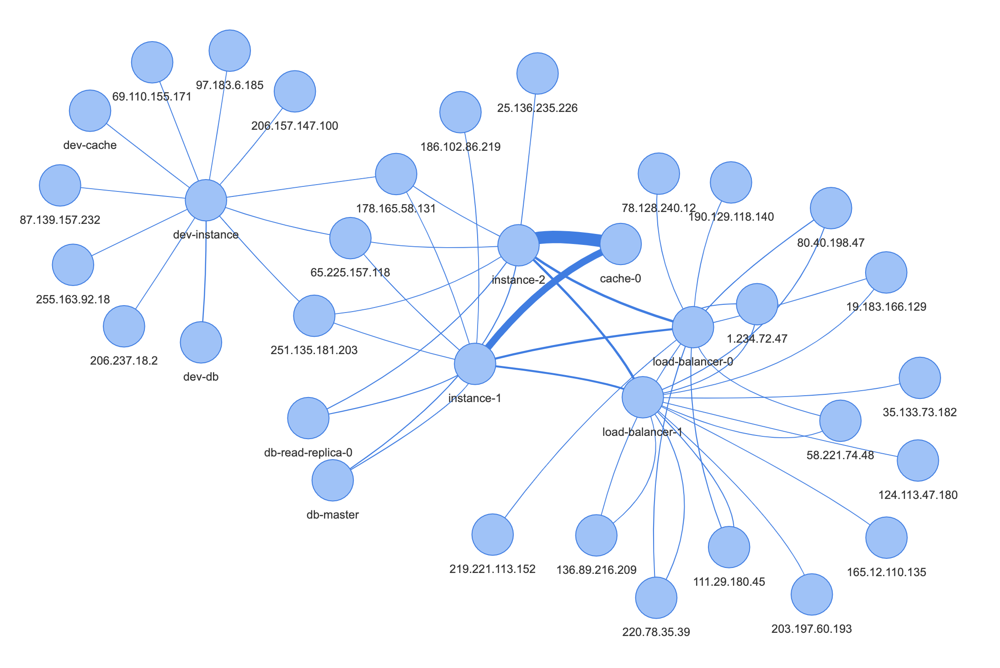

# VPC Flow Log Analysis
The code contained in this repository can analyze AWS VPC flow logs and visualize them in a graph, just like this one:


I have written a blog post on [pfisterer.dev](https://pfisterer.dev) that details how it works, why it's useful and how you can use and adjust it for your own needs:
[Analyzing and Visualizing AWS VPC Flow Logs](https://pfisterer.dev/posts/visualize-vpc-flow-logs-graph).

## Installation
Use `npm install` to install the dependencies.

## Usage
First, you need to create a `.env` file in the root directory with the following variables:
```
AWS_ACCESS_KEY=your-access-key
AWS_SECRET_ACCESS_KEY=your-secret-access-key
AWS_S3_BUCKET_NAME=vpc-flow-log-bucket-name
```

### The Graph Generator
First, you need to create an S3 bucket and enable flow logs for your VPC. This is described in more detail in the [blog post](https://pfisterer.dev/posts/visualize-vpc-flow-logs-graph).

After setup, you can run the graph generator, which downloads flow logs from S3 and generates a `graph.json` file that can later be visualized by using
```
npm run generate-graph
```

### The Client
After running the graph generator, you can start the client using 
```
npm run client
```
This will locally serve a web page that renders the VPC flow log graph.
